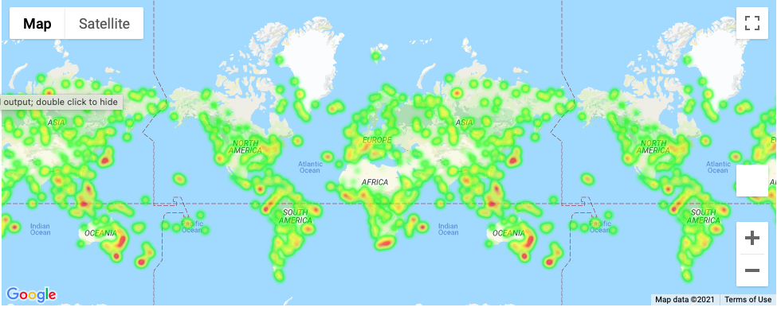
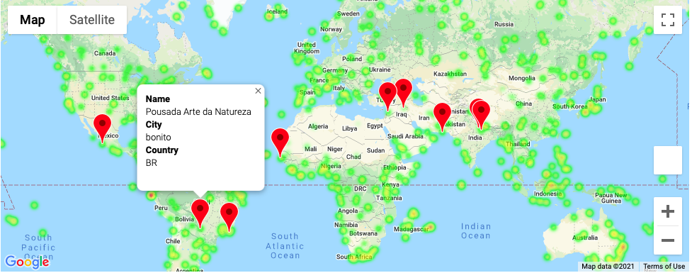

# python-api-challenge

## Introduction

In this assignment I took what I've learned about Python requests, APIs, and JSON traversals to answer a fundamental question: "What's the weather like as we approach the equator?"

## Part I - WeatherPy

In this example, I'll be creating a Python script to visualize the weather of 500+ cities across the world of varying distance from the equator. To accomplish this, I'll be utilizing a [simple Python library](https://pypi.python.org/pypi/citipy), the [OpenWeatherMap API](https://openweathermap.org/api), and a little common sense to create a representative model of weather across world cities.

I created a series of scatter plots to showcase the following relationships:
* Temperature (F) vs. Latitude
* Humidity (%) vs. Latitude
* Cloudiness (%) vs. Latitude
* Wind Speed (mph) vs. Latitude

Some take aways:
* City Latitude and Max Temperature are heavily correlated. 
* The other graphs showed little to no correlation. 

I ran a linear regression on each relationship. This time, separating the plots into Northern Hemisphere (greater than or equal to 0 degrees latitude) and Southern Hemispheres (less than 0 degrees latitude):
* Northern Hemisphere - Temperature (F) vs. Latitude
* Southern Hemisphere - Temperature (F) vs. Latitude
* Northern Hemisphere - Humidity (%) vs. Latitude
* Southern Hemisphere - Humidity (%) vs. Latitude
* Northern Hemisphere - Cloudiness (%) vs. Latitude
* Southern Hemisphere - Cloudiness (%) vs. Latitude
* Northern Hemisphere - Wind Speed (mph) vs. Latitude
* Southern Hemisphere - Wind Speed (mph) vs. Latitude

Some other take aways:
* We already know from the above observation that city latitude and max temperature is correlated. After looking at the split Hemisphere graphs, you can see that the Northern Hemisphere is slightly, more correlated. 
* The other graphs still had little to no correlation.
* All but the Latitude vs Wind Speed graph the northern hemisphere had a higher r-value. So it seems that these variables are more correlated in the Northern Hemisphere. 

## Part II - VacationPy

Now I used my skills from working with weather data to plan future vacations. Use jupyter-gmaps and the Google Places API for this part of the assignment.

I created a heat map that displays the humidity for every city from Part I.

I narrowed down the DataFrame to find my ideal weather condition. Which was:
* A max temperature greater than 80 degrees.
* Wind speed less than 10 mph.
* Zero cloudiness.
* I dropped any rows that did't contain all three conditions.

I used Google Places API to find the first hotel for each city located within 5000 meters of my coordinates.

I then plotted the hotels on top of the humidity heatmap with each pin containing the **Hotel Name**, **City**, and **Country**.

  
